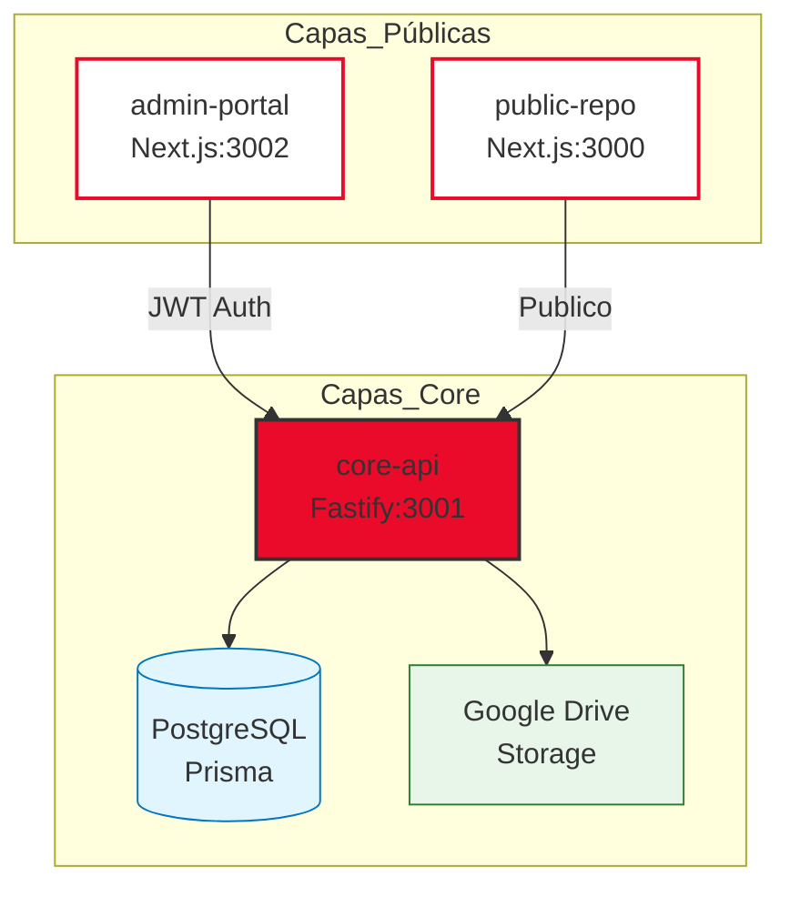
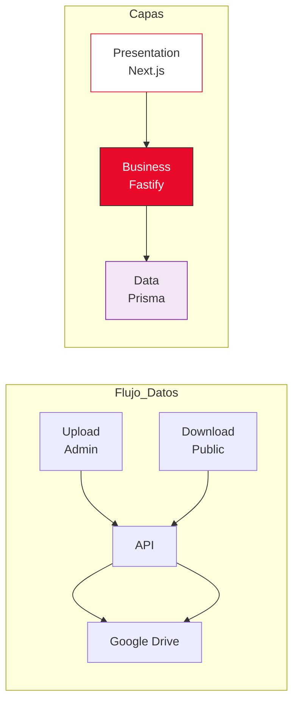
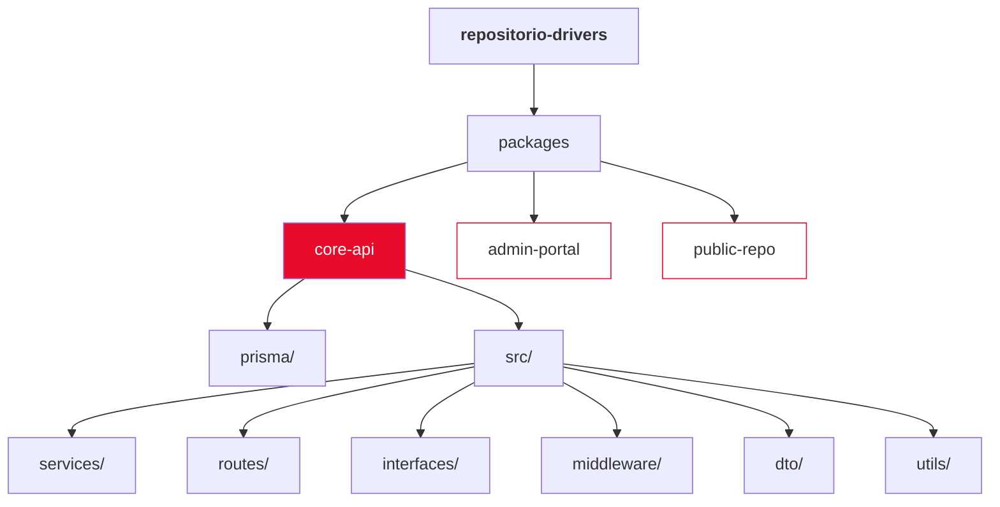
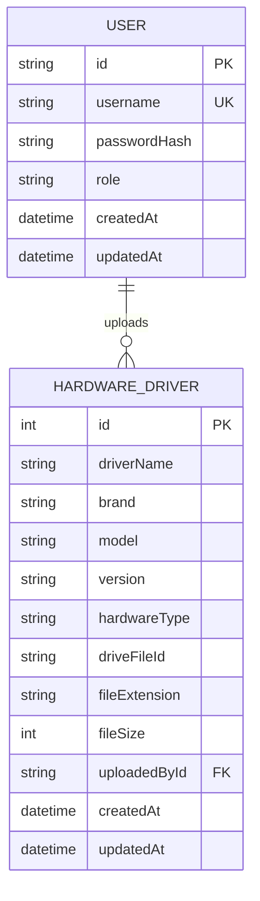
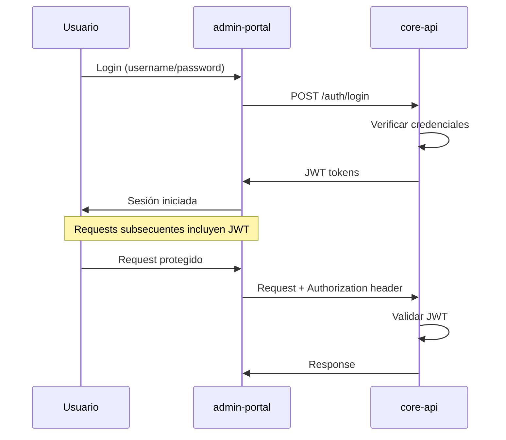

# Repositorio de Drivers Boxito

Sistema de gestión y distribución de drivers de hardware con arquitectura de triple capa.

## Arquitectura



## Arquitectura de Datos



## Paquetes

| Paquete | Descripción | Puerto |
|---------|-------------|--------|
| [core-api](./packages/core-api) | API REST - Nucleo del sistema | 3001 |
| [admin-portal](./packages/admin-portal) | Panel de administración | 3002 |
| [public-repo](./packages/public-repo) | Repositorio público | 3000 |

## Stack Tecnológico

- **Backend**: Node.js + Fastify + TypeScript
- **Base de Datos**: PostgreSQL + Prisma ORM
- **Auth**: JWT + bcryptjs
- **Storage**: Google Drive API (streams para archivos grandes)
- **Frontend**: Next.js 14 + React + Tailwind CSS

## Paleta de Colores

| Color | Hex | Uso |
|-------|-----|-----|
| Rojo Primario | `#EA0B2A` | Botones, logo, acentos |
| Fondo Principal | `#FFFCFD` | Fondo general |
| Negro Profundo | `#000000` | Títulos |
| Gris Soporte | `#6B7280` | Textos secundarios |
| Gris Borde | `#E5E7EB` | Divisores |
| Blanco Puro | `#FFFFFF` | Tarjetas |

##快速开始 (Quick Start)

```bash
# Instalar dependencias
npm install

# Configurar core-api
cd packages/core-api
cp .env.example .env
# Editar .env con tus credenciales

# Generar cliente Prisma y crear tablas
npm run db:push

# Poblar usuarios iniciales
npm run db:seed

# Iniciar desarrollo
npm run dev
```

## Desarrollo

```bash
# Iniciar todos los paquetes (requiere configuración previa)
npm run dev:core-api   # Puerto 3001
npm run dev:admin      # Puerto 3002
npm run dev:public     # Puerto 3000
```

## Estructura de Carpetas



## Modelo de Datos (Prisma)



## Flujo de Autenticación



## Usuarios Iniciales

Tras ejecutar el seed:

| Username | Password | Rol |
|----------|----------|-----|
| admin_sistemas | AdminSistemas2024! | ADMIN_SISTEMAS |
| soporte_wp | SoporteWP2024! | SOPORTE_WP |

## API Endpoints

### Autenticación
- `POST /auth/login` - Iniciar sesión
- `POST /auth/refresh` - Refrescar token

### Drivers
- `GET /drivers` - Listar (cursor pagination)
- `GET /drivers/:id` - Obtener por ID
- `POST /drivers` - Crear driver
- `PUT /drivers/:id` - Actualizar driver
- `DELETE /drivers/:id` - Eliminar driver
- `POST /drivers/upload` - Subir archivo
- `GET /drivers/:id/download` - Descargar (proxy)

### Usuarios (solo ADMIN_SISTEMAS)
- `GET /users` - Listar usuarios
- `POST /users` - Crear usuario
- `DELETE /users/:id` - Eliminar usuario

## Principios de Diseño

- **SOLID**: Patrones Repository, Service, Singleton
- **Zero Trust**: Solo core-api tiene acceso a DB y Google Drive
- **Open/Closed**: Interfaz IStorage para cambio de proveedor
- **Clean Code**: Componentes UI solo renderizan, lógica en services

## Licencia

© 2026 Soporte Técnico e Infraestructura.